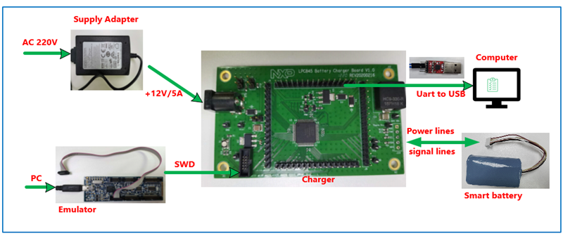
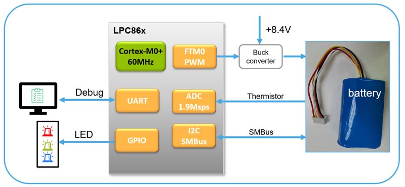
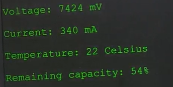

# NXP Application Code Hub

## AN13864: Smart Battery Charger by LPC865 with SMBus Interface
The application of batteries is everywhere: smartphones, notebook computers, wearable devices, handheld electronic products, smart small appliances, and so on. Information about the state of batteries is important for the user, for example, the battery temperature, voltage, current, capacity, how much time is needed to charge the battery and to get it depleted. It is very important to ensure the safety of battery charging and provide a smooth and controllable charging curve. The abovementioned requirements are expected to be realized by a smart charger. A smart charging solution implemented with LPC865 is recommended.

LPC86x is an Arm Cortex-M0+ based, low-cost 32-bit MCU family operating at CPU frequencies of up to 48MHz. LPC86x supports up to 64 KB of flash memory and 8 KB of SRAM. The peripheral complement of the LPC86x includes a CRC engine, one I2C bus interface, one I3C-MIPI bus interface, up to three USARTs, up to two SPI interfaces, one multi-rate timer, self-wake-up timer, two FlexTimers, a DMA, one 12-bit ADC, one analog comparator, function-configurable I/O ports through a switch matrix, an input pattern match engine, and up to 54 general-purpose I/O pins.

#### Boards: Custom Board

#### Categories: Industrial

#### Peripherals: ADC, GPIO, I2C, UART, TIMER, SPI

#### Toolchains: MCUXpresso IDE

## Table of Contents
1. [Software](#step1)
2. [Hardware](#step2)
3. [Setup](#step3)
4. [Results](#step4)
5. [Support](#step5)
7. [Release Notes](#step6)

## 1. Software
- [MCUXpresso IDE V11.9.0 or later](https://www.nxp.com/design/design-center/software/development-software/mcuxpresso-software-and-tools-/mcuxpresso-integrated-development-environment-ide:MCUXpresso-IDE).
- SDK_2_15_000_LPCXpresso860MAX 
- MCUXpresso for Visual Studio Code: This example supports MCUXpresso for Visual Studio Code, for more information about how to use Visual Studio Code please refer [here](https://www.nxp.com/design/training/getting-started-with-mcuxpresso-for-visual-studio-code:TIP-GETTING-STARTED-WITH-MCUXPRESSO-FOR-VS-CODE).

## 2. Hardware
- Micro USB cable
- Personal Computer
- NXP LPC865 battery charger board
- +12V adapter
- Smart battery
- LPC-Link2
- USB to TLL board

## 3. Setup
### 3.1 Step 1

Connect the 12V supply adapter, emulator, smart battery, NXP LPC865 battery charger board , USB to TLL board and computer together as shown below:

The signals connection as below:

### 3.2 Step 2

- Import the project to MCUXpresso IDE.

1. Open MCUXpresso IDE, in the Quick Start Panel, choose **Import from Application Code Hub**.

   ​	

2. Enter the demo name in the search bar.

    

3. Click **Copy GitHub link**, MCUXpresso IDE will automatically retrieve project attributes, then click **Next>**.

   ​	

4. Select **main** branch and then click **Next>**, Select the MCUXpresso project, click **Finish** button to complete import.

   ​	

- Open a serial terminal on PC for the serial device with these settings:
  - 512000 baud rate
  - 8 data bits
  - No parity
  - One stop bit
  - No flow control
- Compile and download to the board.
- Reset and run.

## 4. Results
The demo result as below printed log on the PC widow:

​	

## 5. Support
#### Project Metadata
<!----- Boards ----->

<!----- Categories ----->
 

<!----- Peripherals ----->
 

<!----- Toolchains ----->
 

Questions regarding the content/correctness of this example can be entered as Issues within this GitHub repository.

>**Warning**: For more general technical questions regarding NXP Microcontrollers and the difference in expected funcionality, enter your questions on the [NXP Community Forum](https://community.nxp.com/)

## 6. Release Notes
| Version | Description / Update                           | Date                        |
|:-------:|------------------------------------------------|----------------------------:|
| 1.0     | Initial release on Application Code Hub        | July 16th 2024 |

